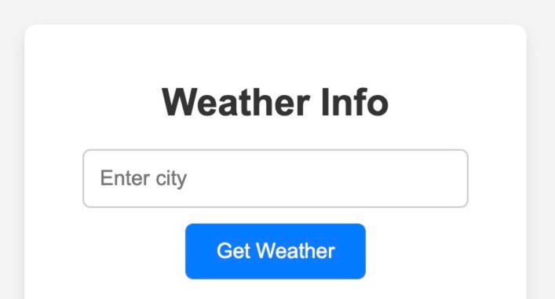
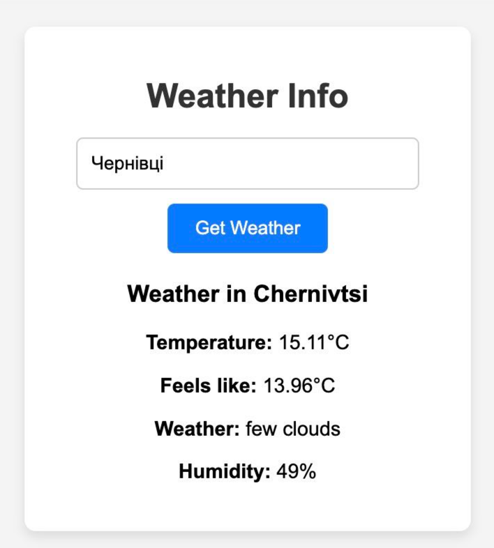
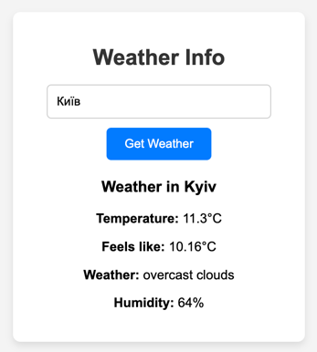

# Laba 2
#### [Back to navigation](https://github.com/SirEnotik/Js-Labs)
## Weather extention

Це Chrome-розширення під назвою "Weather Info Extension" призначене для відображення поточної погоди у вказаному користувачем місті. Користувач вводить назву міста у текстове поле і натискає кнопку "Get Weather" для отримання даних. Розширення робить запит до OpenWeatherMap API, передаючи назву міста і отримуючи інформацію про погоду. Якщо запит успішний, ці дані відображаються на екрані. Якщо місто не знайдено або виникла помилка, користувач отримує відповідне повідомлення. Останнє введене місто зберігається у localStorage, тому при повторному відкритті розширення це місто автоматично підставляється у поле, і запит на погоду виконується повторно.

